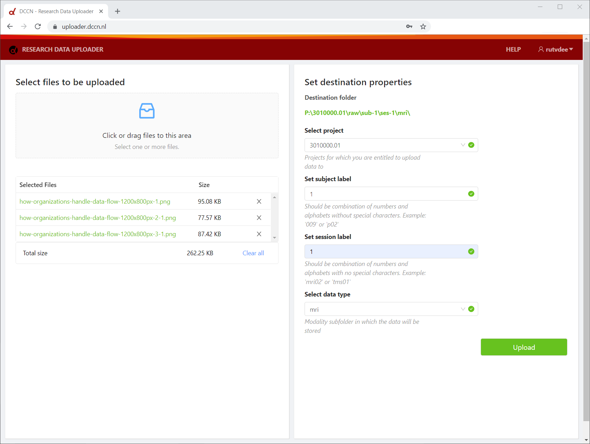

# Streamer UI

The streamer UI is also known as the Research Data Uploader. It is a web interface to upload files from a (lab) PC to both:

1. a project folder on central storage, and
2. the Donders Repository

The purpose of the Research Data Uploader is to enforce a standardized destination folder structure with project number, subject, session, and data type specified (e.g. `/project/3010123.01/raw/sub-1/ses-1/mri/` on central storage) with restrictions on the possible subject and session labels, and possible data types.

The Research Data Uploader is implemented as a React web app that is served by the streamer UI server. The React javascript code runs in the user's web browser and communicates to the streamer UI server via an API thats handles authentication and upload session requests. The streamer UI database is used to facilitate this. 

After a succesful upload session, a streamer job is submitted to the streamer `service` which schedules the transfer of files from the streamer UI buffer directory to the correct destination folder on central storage and in the Donders Repository. Please note that it takes some time to transfer the files. An e-mail will be send to the user if the job was successful or not.

See the [Developer Guide](DEV.md) for installation instructions and implementation details.

A screenshot of the Research Data Uploader can be found below:

## System Architecture

