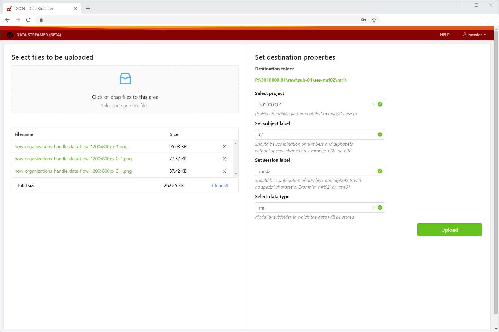
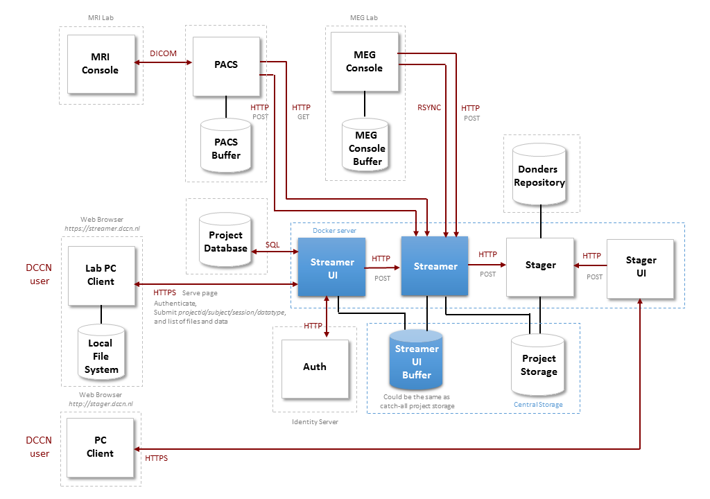

# Streamer UI

The streamer UI is better known as the Research Data Uploader.

It is a web interface to upload files from a (lab) PC to both:

1. your project folder on central storage, and
2. the Donders Repository

The purpose of the Research Data Uploader is to enforce a standardized destination folder structure with project number, subject, session, and data type specified (e.g. `/project/3010123.01/raw/sub-1/ses-1/mri/` on central storage) with restrictions on the possible subject and session labels, and possible data types.

The Research Data Uploader is implemented as a React web app that is served by the streamer UI server. The React javascript code runs in the user's web browser and communicates to the streamer UI server via an API thats handles authentication requests and upload sessions. The streamer UI database is used to facilitate this. 

After a succesful upload session, a streamer job is submitted to the streamer `service` which schedules the transfer of files from the streamer UI buffer directory to the correct destination folder on central storage and in the Donders Repository. Please note that it takes some time to transfer the files. An e-mail will be send to the user if the job was successful or not.

A screenshot of the Research Data Uploader can be found below:



## System Architecture



## Implementation Details

### Signing in and signing out

Before the user can start uploading files, he/she is prompted with a login screen. 
The user needs to fill in his/her DCCN user credentials.
We use `authState` and `authErrorState` to keep track of the login stage. 

The following stages exist:
```
NotLoggedIn (initial state)
Selecting (user changes tsername and password)
LoggingIn (attempt to redirect to upload page)
LoggedIn (success)
LoggingOut (redirect to login page)
```
The enum `AuthStatus` is used for this purpose. React hooks are used to update the `authState` when appropriate.
If an exception occurs the `authErrorState` is set accordingly. An error modal is shown to the user.

If `LoggedIn`, the upload page is shown.

### Uploading

The following upload stages exist:
```
NotUploading (initial state)
Selecting (user changes form input fields and file selection)
Initiating (start with upload session; request an upload session id)
Validating (validate files to be uploaded; check if they already exist in project storage folder)
Confirming (ask the user for confirmation if destination folder and file(s) already exist)
Uploading (copy files to streamer UI buffer directory)
Finalizing (wrap up upload session)
Submitting (submitting streamer job)
Success (done)
```
The enum `UploadStatus` is used for this purpose. React hooks are used to update the `uploadState` when appropriate.
In addition, `errorState` is used to capture any exception that might occur. An error modal is shown to the user in case an exception occurs. 

After the user has selected files, he/she selects the approriate project, sets the subject label and session label, and selects the data type. If the data type is not in the list of allowed data types, the user can select "other" and set this value.

When satisfied, the upload button can be pressed and an upload session is inititated. The upload modal is shown with the upload progress. After initiating, each file to be uploaded is validated. Might any of the files already exist in the destination folders, then the user is prompted with a confirmation modal. If the userr approves and presses the OK button, the actual upload is started. The files are transferred to the streamer UI buffer directory. When this operation was succesful, the upload session is finalized.

A submit request is sent to the `service` which queues a streamer job. After some delay, an e-mail will be sent to the user with the result.
